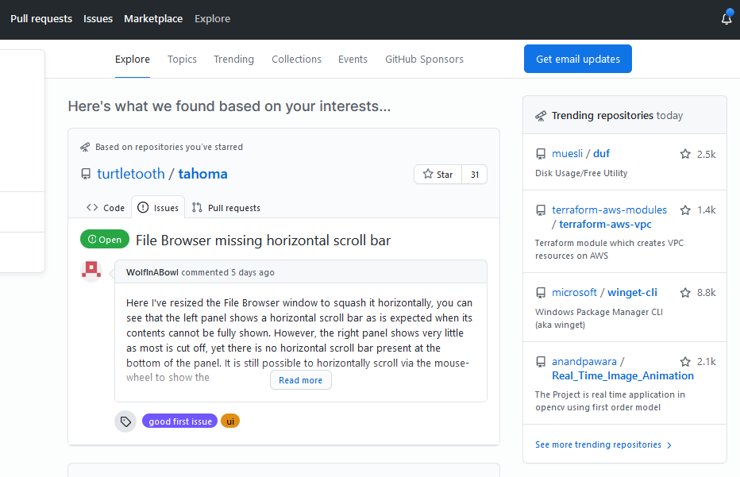
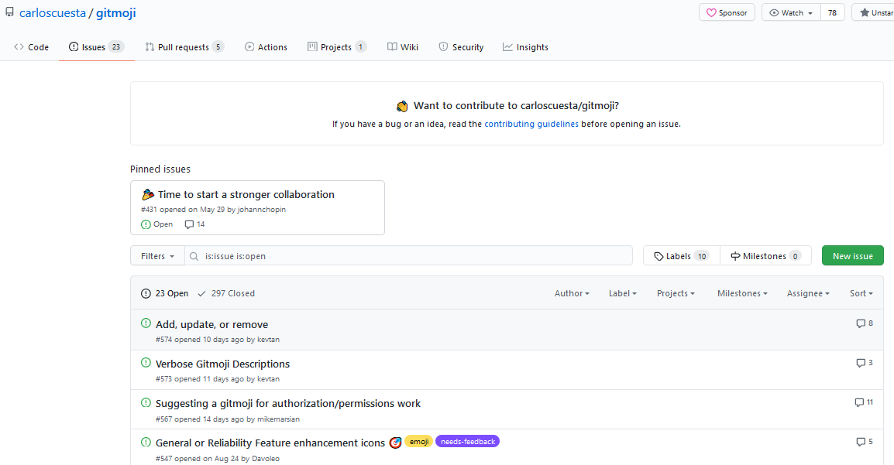
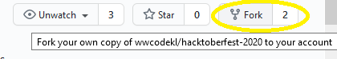
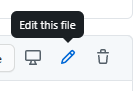
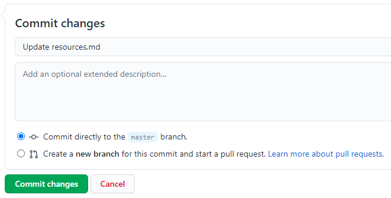
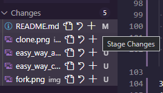
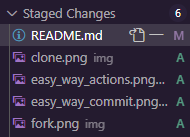
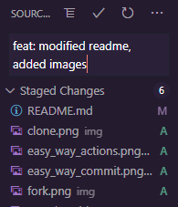
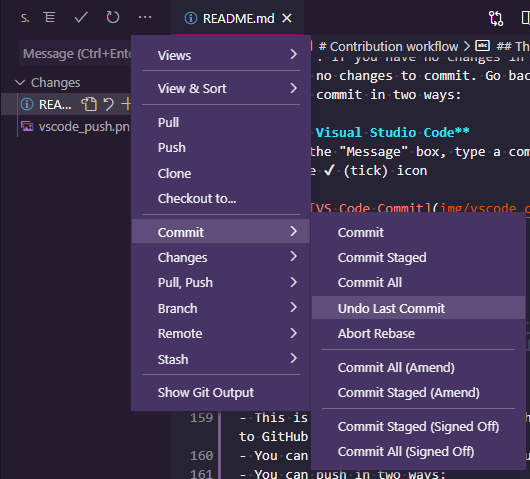
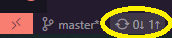

# Overview

This project serves as a guide for people who want to try their hand at making a pull request on GitHub.

In conjuction with Hacktoberfest 2020 organised by Digital Ocean.

# What is Git and GitHub?

[Git](https://git-scm.com) is a version control system for tracking and manage changes in your files.

[GitHub](https://github.com) is an online hosting service for Git, where you can keep your files online, collaborate with others, manage issues and many more. It's also where a lot of open source projects are hosted!

GitHub is not the only online service out there - there are others like [BitBucket](https://bitbucket.org) and [GitLab](https://gitlab.com).

For Hacktoberfest, your contributions will be tracked on GitHub only.

## Explore on GitHub

The Explore tab is where you can find all the happening stuff - you can check out trending repositories and scroll through various topics.



Some repositories are tagged with **topics** to attract first-time contributors and seasoned gurus alike.

Some popular topics are [`hacktoberfest`](https://github.com/topics/hacktoberfest), [`good-first-issue`](https://github.com/topics/good-first-issue), [`contributions-welcome`](https://github.com/topics/contributions-welcome), [`up-for-grabs`](https://github.com/topics/up-for-grabs), [`first-timers`](https://github.com/topics/first-timers)

On a repository you will see an "Issues" tab, where there are a list of items that people have added which could be a bug to fix, a feature to add, a performance improvement, anything!




Some issues are tagged with **labels**, which allow people to see at a glance the nature of the issue. You can click into Labels to see how many are in a given repository (some popular ones to entice contributors are `help wanted` or `good first issue`).


# Contribution workflow

Have you found a project you like? Nice! Now it is time to make stuff happen.


## What you need
- [Git](https://git-scm.com/)
- [Visual Studio Code](https://code.visualstudio.com/) is a popular code editor that has a handy interface for you to work with Git repositories
- [A GitHub account](https://github.com)


## The easy way
The really easy way is to make changes on GitHub itself.

For code, that's usually not ideal as you want to run your code and test your changes. If you're editing a single document it doesn't matter as much - I usually do this when changing markdown files.

1. Fork
- Forking a repo means that you are making a copy of it in your account. Then you can make your changes totally independent of the original repository.

    

2. Make changes
- GitHub provides you some actions to perform on any single file in the repo - you can edit it directly or delete it.

    

3. Commit your changes
- You would need to commit these changes for them to take effect. When you "commit changes" here, you are saving the changes you've made in your forked repo.

    

4. Pull Request
- Now you can request for the original repository to accept your changes - that's called a pull request on GitHub. The maintainer of the repository can review your work and decide if it's okay to merge.

    <!-- TODO:  -->

## The regular way

1. Fork
- This is the same as the easy way

2. Clone the project onto your machine
- You can do this step in 2 ways

    **2a. Visual Studio Code**
    - Copy the url of your forked repository.
    - Now open up [Visual Studio Code](https://code.visualstudio.com/)
    - Select the Source Control tab (it has 3 circles) and click Clone Repository.

        

    - You will be prompted to enter a URL - insert the link of your forked repo.

        <!-- TODO  -->

    - There is now a folder called Malaya on your machine

    **2b. Terminal/Command Line**
    - Copy the url of your forked repository.
    - Go to the folder in which you want to store the project
    - Open your terminal here
     - Use the [git](https://git-scm.com) command to [clone](https://git-scm.com/docs/git-clone) the project

        ```sh
        git clone https://github.com/huseinzol05/Malaya
        ```
        
    - There should now be a folder called `Malaya` on your machine

3. Change the file/files

4. Add to staging
- Adding files to staging means that you're preparing these files for the next commit - you're saying, this set of changes should be included. The staging area helps you to track your intentional/unintentional changes as you work.
- You can do this step in 2 ways:

    **4a. Visual Studio Code**
    - In the Source Control tab, click the + icon to stage your file changes
    
        

    - You can unstage changes by clicking the - icon.

        

    **4b. Terminal/Command Line**
    - To stage changes:

        ```sh
        # stage a single file
        git add [filepath]
        # stage all files in current directory
        git add .
        ```
    - To unstage changes:

        ```sh
        # unstage a single files in current directory
        git rm [filepath]
        # unstage all files in current directory
        git rm .
        ```

5. Commit
- When you are happy with your final changes, you can commit them i.e. save your changes to your local repository
- This will generate a snapshot of your project at this point and you can always come back to this snapshot in the future.
- Each commit should be made with a message to give more clarity on what that set of changes is about
- **NOTE**: If you have no changes in the staging area, then there are no changes to commit. Go back and do step 4.
- You can commit in two ways:

    **5a. Visual Studio Code**
    - In the "Message" box, type a commit message, then click on the ✔ (tick) icon

        
    
    - You can undo your last commit via the "..." menu

        

    **5b. Terminal/Command Line**
    - Commit with a message

        ```sh
        git commit -m "feat: modified readme, added images"
        ```
    - Undo your last commit

        ```sh
        git reset HEAD~1
        ```

6. Push
- Upload or "push" your changes from your machine to GitHub 🚀
- You can make multiple commits and push them in one go.
- You can push in two ways:

    **6a. Visual Studio Code**
    - VS Code displays to you **which branch** you're on and **how many commits** are ready to be pushed.
    - In the example below, there is 1 commit ready to be pushed ⬆ to the `master` branch. Click on that to push your changes.
    

    **6b. Terminal/Command Line**
    - Check which branch you're on
    ```sh
    git branch --show-current
    ```
    - Check how many commits you are ahead of your remote branch (eg. if your branch is `master`)
    ```sh
    git log origin/master..master
    ```
    - Push your changes
    ```sh
    git push origin master
    ```
    

7. Pull Request
- This is the same as the easy way


---

# Final notes

You're Hacktoberfest-ready now! Go learn stuff, have fun and remember:

- Make meaningful contributions - the spirit of Hacktoberfest is to help make the open source ecosystem better for everyone
- Not all contributions have to be code
- Be kind to maintainers - they are people with their own jobs and likely have a lot of PRs to go through (especially in October)!

The world of open source awaits ✨

---

# Contribute to this project

If you could help populate the two sections below, that would be awesome :)

---

## Projects
A curated list of projects to contribute to
<!-- 
Copy and paste this line and change the content as necessary
- [insert title here](insert link here) - insert description of the project
-->
- [Malaya](https://github.com/huseinzol05/Malaya) -  a Natural-Language-Toolkit library for bahasa Malaysia, powered by Deep Learning Tensorflow
- [Healthcare ASEAN]((https://github.com/DataKind-SG/healthcare_ASEAN))
- [69 Beginner Friendly Projects](https://miguendes.me/hacktoberfest-69-beginner-friendly-projects-you-can-contribute-to-ckfnnrnjv00140ks1423kh7qp)
---

## Resources
List of resources that's useful for people getting started with open source
<!-- 
Copy and paste this line and change the content as necessary
- [insert title here](insert link here)
-->
- [Hacktoberfest details](https://hacktoberfest.digitalocean.com/details)
