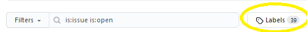

# Overview

This project serves as a guide for people who want to try their hand at making a pull request on GitHub.

In conjuction with Hacktoberfest 2020 organised by Digital Ocean.

# What is Git and GitHub?

[Git](https://git-scm.com) is a version control system for tracking and manage changes in your files.

[GitHub](https://github.com) is an online hosting service for Git, where you can keep your files online, collaborate with others, manage issues and many more. It's also where a lot of open source projects are hosted!

GitHub is not the only online service out there - there are others like [BitBucket](https://bitbucket.org) and [GitLab](https://gitlab.com).

For Hacktoberfest, your contributions will be tracked on GitHub only.

## Explore on GitHub

The Explore tab is where you can find all the happening stuff - you can check out trending repositories and scroll through various topics.

Some repositories are tagged with **topics** to attract first-time contributors and seasoned gurus alike.

Some popular topics are [`hacktoberfest`](https://github.com/topics/hacktoberfest), [`good-first-issue`](https://github.com/topics/good-first-issue), [`contributions-welcome`](https://github.com/topics/contributions-welcome), [`up-for-grabs`](https://github.com/topics/up-for-grabs), [`first-timers`](https://github.com/topics/first-timers)

On a repository you will see an "Issues" tab, where there are a list of items that people have added which could be a bug to fix, a feature to add, a performance improvement, anything!

Some issues are tagged with **labels**, which allow people to see at a glance the nature of the issue. You can click into Labels to see how many are in a given repository (some popular ones to entice contributors are `help wanted` or `good first issue`).

# Contribution workflow

Have you found a project you like? Nice! Now it is time to make stuff happen.

<!--
fork, clone, branch, staging, pull request
-->

# Go forth!

You're Hacktoberfest-ready now! Go make things happen, learn stuff, and have fun! The world of open source awaits ✨

# Try it out

Want to try making a Pull Request just to get used to it? You can do it right here!

1. **Projects**: Add projects you think are interesting in  (it can include your own project too)
2. **Emoji Party**: Join the party below - add emojis 🧐
3. **Resources**: For any useful resources

---

## Projects
- [Malaya](https://github.com/huseinzol05/Malaya)
- [Healthcare ASEAN]((https://github.com/DataKind-SG/healthcare_ASEAN))
<!-- Add a new project: 
- [insert title here](insert link here) 
-->
---

## Emoji party
😎🐼😲[ new emojis welcome ]

--- 

## Resources
- [Hacktoberfest 2020 details](https://hacktoberfest.digitalocean.com/details)
<!-- Add a new project: 
- [insert title here](insert link here) 
-->
